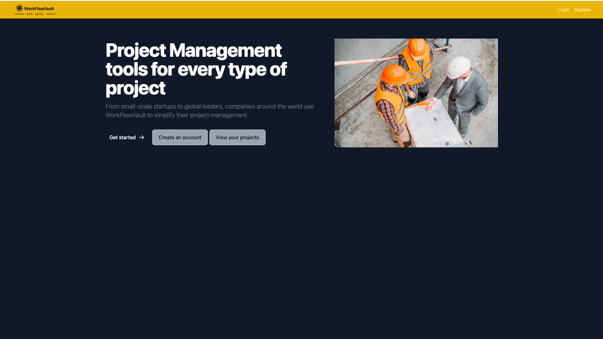
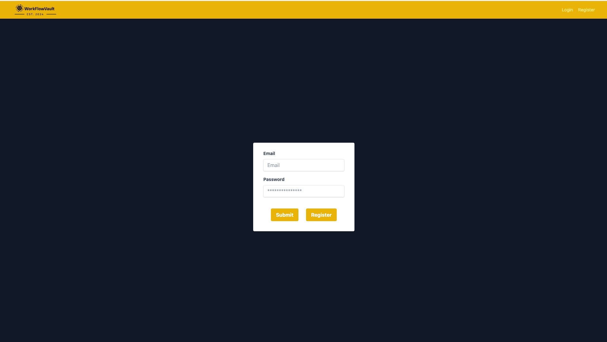
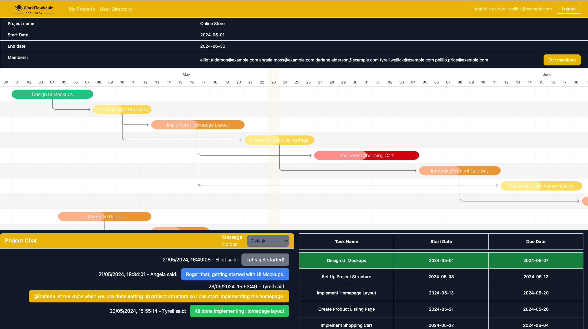

# WorkFlowVault

## Description

WorkflowVault is a comprehensive project management and employee tracking platform designed to streamline operations, enhance collaboration, and boost productivity. The application will be a web-based solution accessible through modern web browsers on desktops and mobile devices.

## Target Audience

- Tradespeople: Individual tradespeople such as electricians, plumbers, HVAC technicians, carpenters, builders, landscapers, and similar professionals who operate their own businesses or work in small teams.
- Small Contractors: Small contracting businesses with a team of employees who perform various services in the construction, maintenance, and repair sectors.
- Service Businesses: Companies providing field services such as installation, repair, maintenance, and inspection services to residential and commercial customers.
- Mobile Workforces: Businesses with mobile workforces that operate remotely or travel to different job sites to deliver services.

## Team Members

- Amrinder Singh
- Aaron Hopkins

## Commissioned By

- Ben Ottoman

## Technology Stack

- Astro.build
- ReactJS
- TailwindCSS
- MongoDB
- Netlify

## Screenshots and Videos

